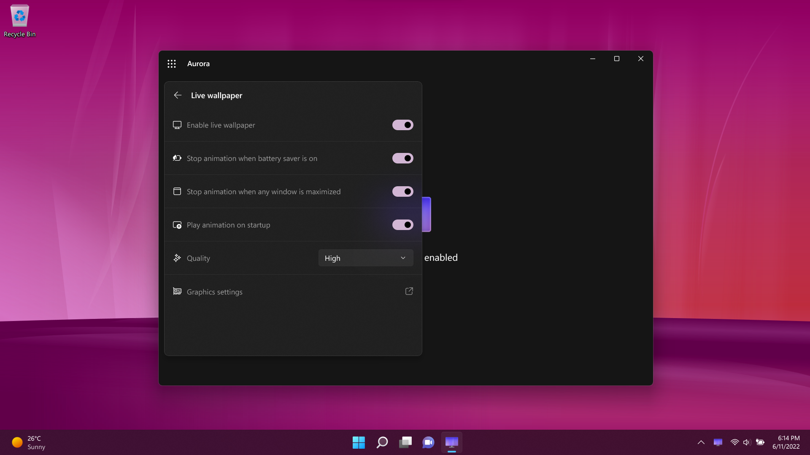

# Aurora Wallpaper

Welcome to the official issue-only repo for Aurora Wallpaper. Aurora Wallpaper is a Desktop Bridge app (UWP + WPF) and displays Longhorn-styled animation in window or on the desktop as live wallpaper. Users can save certain frames of animation on local disk.

**Important!** This application uses parts of source code from prerelease version of Windows code-named Longhorn owned by Microsoft Corporation. Source code has been ported to UWP.

  

  

Feel free to share ideas about new features or report bugs.
