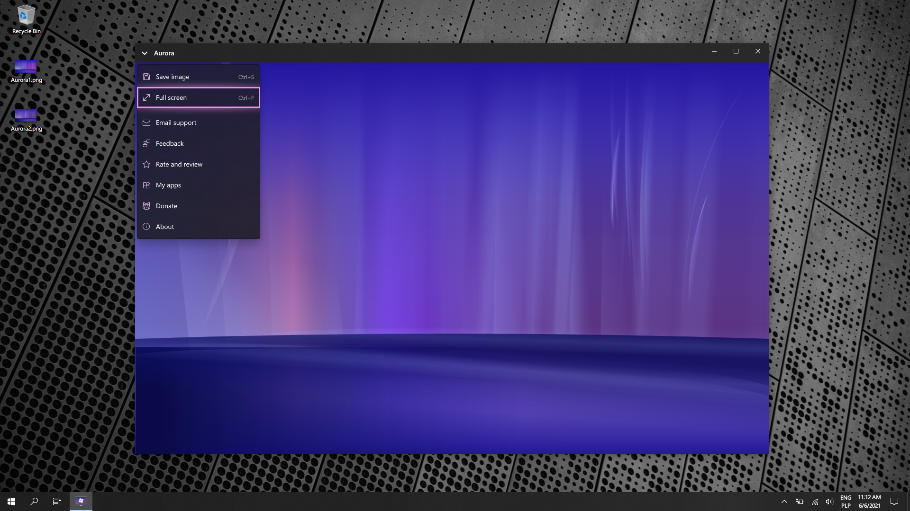

# Aurora

Welcome to the official issue-only repo for Aurora. Aurora is a simple UWP application that display Longhorn-styled animations in window. User can save certain frames of animations on local disk.

**Important!** This application uses parts of source code from prerelease version of Windows code-named Longhorn owned by Microsoft Corporation. Source code has been ported to UWP.

Microsoft Store: https://www.microsoft.com/store/apps/9P3CBGSKBRQP

Feel free to share ideas about new features or report bugs.